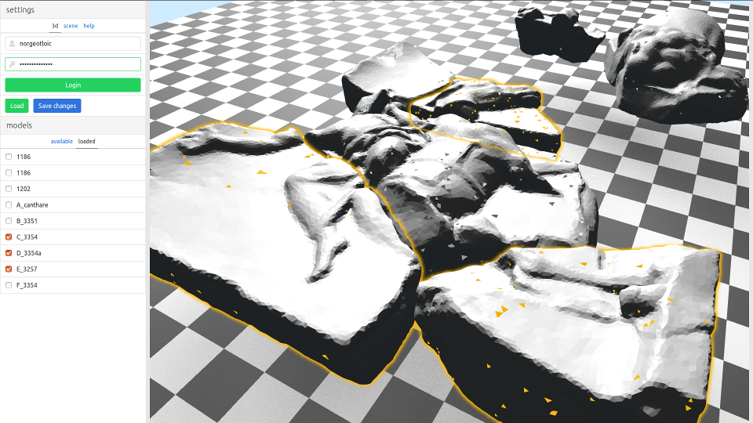

# Numero @ ISCD

Application web pour l'assemblage de fragments du décor du théatre d'Orange. L'application est disponible en ligne [ici](https://numerosu.github.io/online-application/numero).

* [Documentation utilisateur](https://numerosu.github.io/online-application/blob/master/docs/user.md)
* [Documentation développeur](https://numerosu.github.io/online-application/blob/master/docs/dev.md)
* [TODO](https://numerosu.github.io/online-application/numero/issues/1)

